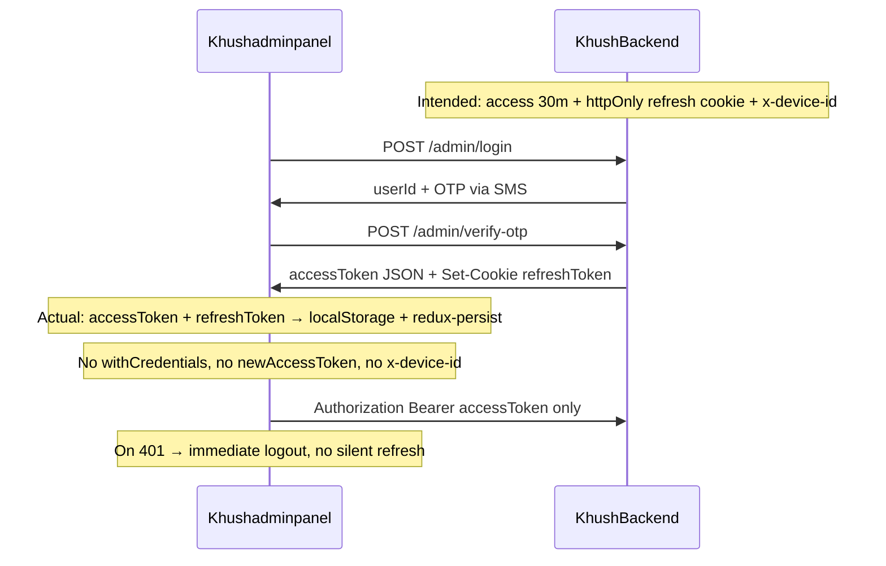

# Khushadminpanel — Security Audit (vs KhushBackend)

**Date:** June 22, 2026  
**Scope:** Entire `Khushadminpanel` codebase — admin, subadmin, driver, influencer, support-agent, order-agent, and designer panels  
**Method:** Static code review — auth, tokens, API client, route guards, module gating, env, XSS surface, backend alignment  
**Compared against:** [KhushBackend/docs/BACKEND_SECURITY_AUDIT.md](../../KhushBackend/docs/BACKEND_SECURITY_AUDIT.md), [KhushBackend/docs/MODULE_ACCESS.md](../../KhushBackend/docs/MODULE_ACCESS.md), [docs/JWT_SECURITY_AUDIT.md](../../docs/JWT_SECURITY_AUDIT.md)

---

## Executive Summary

| Severity | Count | Examples |
|----------|-------|----------|
| **Critical** | 0 | No hardcoded secrets or public admin registration in the frontend itself |
| **High** | 6 | JWT + refresh in `localStorage`; no refresh flow; hardcoded prod API URL; OTP leakage; socket/API host mismatch |
| **Medium** | 12 | No JWT `exp` check; UI-only subadmin gating; no CSP; env/gitignore gaps; backend module/route mismatch |
| **Low** | 8 | Debug flags; static `dangerouslySetInnerHTML`; dev server `host: true`; UI prefs in storage |

**Bottom line:** KhushBackend has hardened staff auth (30-minute access tokens, httpOnly refresh cookies, Redis denylist on logout, rate-limited OTP, DB-verified admin roles). **Khushadminpanel largely ignores those backend controls** — it stores both access and refresh tokens in `localStorage`, does not send cookies (`withCredentials`), never calls `newAccessToken`, and leaks OTPs in logs and router state. Any XSS on the admin origin can steal operator credentials and perform privileged actions until the access token expires.

---

## Architecture: Intended Backend vs Actual Client



---

## 20-Area Security Checklist (Admin Panel vs Backend)

| # | Area | Backend | Admin Panel | Gap |
|---|------|:-------:|:-----------:|-----|
| 1 | Access token TTL | ✅ 30m (`jwt.config.js`) | ❌ No `exp` check in route guards | Expired JWT may keep UI until API returns 401 |
| 2 | Refresh token storage | ✅ httpOnly cookie + Redis | ❌ `localStorage` + redux-persist | Cookie ignored; refresh token XSS-stealable |
| 3 | Token refresh flow | ✅ `POST …/newAccessToken` | ❌ Never implemented | 401 → logout instead of refresh |
| 4 | Device binding | ✅ `x-device-id` header | ❌ Not sent by axios client | Refresh would fail even if added |
| 5 | Logout / revocation | ✅ `jti` denylist + cookie clear | ⚠️ API logout called; client clears storage only | Stolen access token valid until expiry |
| 6 | Role enforcement | ✅ `role.middleware.js` + DB verify | ⚠️ `jwt-decode` only (no signature verify) | UI gate only; security depends on backend |
| 7 | Module access (subadmin) | ✅ Server-side module keys | ⚠️ `SubadminModuleGate` UI-only | Direct API calls bypass UI |
| 8 | Catalog API delegation | ⚠️ Many routes `allowRoles("admin")` only | ⚠️ UI shows panels subadmin cannot call | Functional + security confusion |
| 9 | CORS | ✅ Allowlist incl. `admin.khushpehno.com` | N/A (client) | Must deploy from allowed origin |
| 10 | Rate limiting (auth) | ✅ login/OTP/verify/refresh limiters | ❌ No 429 handling in client | Rapid retry loops possible |
| 11 | Security headers | ✅ `helmet()` on API | ❌ No CSP in `index.html` / Vite | Larger XSS blast radius |
| 12 | OTP handling | ✅ SMS in production | ❌ Logged + passed in router state | OTP visible in DevTools/console |
| 13 | Token in URL params | ✅ HTTP routes use Bearer header | ✅ REST uses Bearer; socket uses `auth.token` | Socket token visible in DevTools |
| 14 | Staff self-registration | ✅ Blocked via `blockPublicStaffRegister` (prod) | N/A | Backend env flag still matters |
| 15 | Input validation | ✅ express-validator on backend | ⚠️ Client-only regex on phone/OTP | Bypassable; backend must validate |
| 16 | XSS surface | N/A | ✅ No `eval`; chat as text nodes | One static `dangerouslySetInnerHTML` |
| 17 | CSRF | ⚠️ Cookie refresh + SameSite=lax | ✅ Bearer-only REST (lower CSRF risk) | Mismatch if cookies ever used without credentials |
| 18 | Environment / secrets | ✅ `.env` gitignored | ❌ `.env.development` not gitignored; `VITE_*` bundled | Maps key visible in browser |
| 19 | API base URL config | N/A | ❌ Hardcoded production URL | Dev builds hit prod API |
| 20 | Multi-panel token isolation | N/A | ❌ Shared `token` key across all roles | Cross-panel session overwrite |

**Legend:** ✅ Pass · ⚠️ Partial · ❌ Fail

---

## HIGH Findings

### H1 — Access and refresh JWT stored in `localStorage` + redux-persist

**Files:**
- `src/redux/GlobalSlice.js` lines 34–47, 62–68
- `src/redux/Appstore.js` lines 6–10 (`redux-persist/lib/storage` → `localStorage`)
- `src/orderAgent/components/Auth/Otp.jsx` lines 96–98 (direct write)
- `src/influencer/influencerapis/authapi.js` lines 74–75 (direct write)

```javascript
// GlobalSlice.js — setToken
if (accessToken) {
  localStorage.setItem("token", accessToken);
  if (refreshToken) localStorage.setItem("refreshToken", refreshToken);
}
```

**Impact:** Any XSS on `admin.khushpehno.com` (or dev host) can exfiltrate bearer tokens. Tokens survive browser restarts. Contradicts backend design of httpOnly refresh cookies.

**Backend alignment:** Backend sets refresh token in httpOnly cookie (`authCookie.util.js`, `refreshTokenFlow.util.js`). Client never reads that cookie because axios has no `withCredentials: true`.

---

### H2 — Shared `token` localStorage key across all staff panels

**Files:** `src/redux/GlobalSlice.js`, `src/utils/authRole.js` (`clearOtherPanelSessions` clears OTP helper keys only, not JWT)

All panels (admin, subadmin, driver, influencer, support-agent, order-agent, designer) read/write the same `"token"` key.

**Impact:** Logging into one role overwrites another's session. A token stolen from one panel may be valid on APIs for that JWT role. Operator confusion and session bleed on shared machines.

---

### H3 — No token refresh flow; refresh token stored but never used

**Files:**
- `src/admin/services/Apiconnector.js` — no `withCredentials`, no refresh interceptor
- `src/driver/apis/driverApi.js` line 14 — defines `NEW_ACCESS_TOKEN` endpoint but **nothing calls it**
- `src/redux/GlobalSlice.js` — stores `refreshToken` but no consumer

**Impact:** Users are logged out on first 401 after 30 minutes instead of silent refresh. Refresh tokens sit in `localStorage` indefinitely with no lifecycle — pure XSS risk with no benefit.

**Backend alignment:** Backend exposes `POST /api/admin/newAccessToken` and `POST /api/subadmin/newAccessToken` with cookie + `x-device-id`. Admin panel does not use them.

---

### H4 — Production API URL hardcoded; `VITE_API_BASE_URL` ignored

**File:** `src/admin/services/Apiconnector.js` lines 9–14

```javascript
const apiBaseUrl ="https://api.khushpehno.com/api"
// import.meta.env.VITE_API_BASE_URL is commented out
```

`.env.development` sets `VITE_API_BASE_URL=http://apidev.khushpehno.com/api` but the main REST client ignores it.

**Impact:** Local/dev builds always call production API — risk of accidental data changes, testing against live users/orders, and false confidence from env files.

---

### H5 — Socket URL and REST API URL can diverge

| Component | Base URL source |
|-----------|-----------------|
| `Apiconnector.js` | Hardcoded `https://api.khushpehno.com/api` |
| `NotificationContext.jsx` lines 12–15 | `VITE_API_BASE_URL` or fallback `http://localhost:5000/api` |

**Impact:** Notifications and Socket.IO may connect to a different host than REST. Real-time features fail silently or connect to wrong environment while CRUD hits production.

---

### H6 — OTP leakage in console logs and React Router state

**Files:**

| Issue | File | Lines |
|-------|------|-------|
| `console.log("OTP received:", res.data.otp)` | `src/admin/components/Auth/Login.jsx` | 49 |
| OTP in `navigate(…, { state: { OTP: res.data.otp } })` | `src/admin/components/Auth/Login.jsx` | 51–56 |
| OTP in router state | `src/orderAgent/components/Auth/Login.jsx` | 54–55 |
| OTP in router state | `src/supportAgent/components/Auth/Login.jsx` | 56–61 |

**Impact:** OTP visible in browser console, React DevTools, and history state. Combined with backend returning OTP in API response (common in dev), this defeats SMS-only OTP delivery.

---

## MEDIUM Findings

### M1 — No JWT expiration check in route guards

**Files:** `src/utils/authRole.js` (`decodeTokenRole`), `src/utils/ProtectedRoute.jsx` lines 46–50

`jwt-decode` reads the `role` claim but never checks `exp`. Expired tokens keep UI access until an API call returns 401.

---

### M2 — `refereshToken` typo may drop refresh token on admin login

**File:** `src/admin/components/Auth/Otp.jsx` line 125

```javascript
const refreshToken = res.data.refereshToken;
```

Support-agent OTP handles both spellings (`refreshToken ?? refereshToken`). Admin OTP only reads the typo key. If backend omits refresh from JSON (correct behavior), this is moot; if backend still returns `refreshToken`, admin flow misses it.

---

### M3 — Subadmin module gating is UI-only, not a security boundary

**Files:**
- `src/components/SubadminModuleGate.jsx`
- `src/context/ModuleAccessContext.jsx`
- `src/config/adminPanelModuleMap.js`

Module access from `GET /api/subadmin/my-module-access` hides sidebar entries and blocks render via `AccessDenied`. Routes are still registered in React Router; there is no per-route server call before render.

**Impact:** Knowledgeable user can call backend APIs directly with a subadmin JWT. Security must be enforced in `role.middleware.js` on every endpoint.

---

### M4 — Backend module grants vs route `allowRoles` mismatch

**Docs:** `KhushBackend/docs/MODULE_ACCESS.md`  
**Backend:** Many catalog/CMS routes use `allowRoles("admin")` only (e.g. `categories.routes.js`, `item.routes.js`, `coupon.routes.js`).

**Impact:** Subadmin UI may show panels (mapped in `adminPanelModuleMap.js`) for modules like `items`, `categories`, `coupons`, but API calls return **403**. Operators see confusing errors; security relies on backend denial, not UI hiding alone.

---

### M5 — `super_subadmin` normalized to `SUBADMIN` on client

**File:** `src/utils/authRole.js` lines 3–5

```javascript
const ROLE_ALIASES = { SUPER_SUBADMIN: "SUBADMIN" };
```

Some backend routes omit `super_subadmin` from `allowRoles` (e.g. `adminOrder.routes.js` uses `admin`, `subadmin` only). Super subadmins may get 403 on order APIs despite module grants.

---

### M6 — Pre-authentication PII persisted in storage

| Data | Storage | File |
|------|---------|------|
| `admin_userId`, `admin_phone` | `localStorage` | `src/admin/components/Auth/Login.jsx` 47–48 |
| `userId` (influencer) | `localStorage` | `src/influencer/influencerapis/authapi.js` 35 |
| `orderAgent_agentId`, `orderAgent_phone` | `localStorage` | `src/orderAgent/components/Auth/Login.jsx` 52–53 |
| `supportAgent_agentId`, `supportAgent_phone` | `localStorage` | `src/supportAgent/components/Auth/Login.jsx` 54–55 |
| `subadminUserId`, `subadminPhone` | `sessionStorage` | `src/subadmin/components/Auth/Login.jsx` 40–41 |
| `driverUserId`, `driverPhone` | `sessionStorage` | `src/driver/drivercomponent/Auth/Login.jsx` 33–34 |

**Impact:** Phone numbers and user IDs persist across sessions; lower severity than tokens but unnecessary PII retention.

---

### M7 — No Content-Security-Policy

**Files:** `index.html` (no CSP meta), `vite.config.js` (no security headers plugin)

**Impact:** No defense-in-depth against XSS. Third-party scripts and inline content are unconstrained at the SPA layer. CSP should be set at CDN/reverse-proxy in production.

---

### M8 — `.env.development` and `dist/` not gitignored

**File:** `.gitignore` — ignores `*.local` but not `.env`, `.env.development`, or `dist/`

**Current `.env.development`:**
```
VITE_API_BASE_URL=http://apidev.khushpehno.com/api
VITE_DEBUG_ORDER_AGENT=true
```

No secrets today, but `VITE_*` variables are embedded in production JS bundles at build time.

---

### M9 — `VITE_GOOGLE_MAPS_EMBED_KEY` exposed in client bundle

**File:** `src/driver/drivercomponent/Home/AssignmentDetails.jsx` line 434

Embed key is visible in page source. Must be restricted by HTTP referrer in Google Cloud Console.

---

### M10 — Influencer logout uses undefined `VITE_BASE_URL`

**File:** `src/influencer/influencercomponents/common/sidebar.jsx` line 31

```javascript
await fetch(`${import.meta.env.VITE_BASE_URL}/api/influencer/logout`, …)
```

`VITE_BASE_URL` is not defined in `.env.development`. Built assets may request `undefined/api/influencer/logout`. Server-side session invalidation may never run; token cleared client-side only.

---

### M11 — Debug logging flags can ship in production builds

| Flag | File |
|------|------|
| `VITE_DEBUG_ORDER_AGENT` | `src/orderAgent/orderAgentShared.jsx` |
| `VITE_DEBUG_ORDERS` | `src/admin/components/orders/order.jsx` |

When `true` in env used for production build, verbose console logging may leak operational data.

---

### M12 — JWT payload logged on subadmin OTP verify

**File:** `src/subadmin/components/Auth/Otp.jsx` line 71

`console.log("[SUBADMIN_VERIFY][REQ]", …)` and related logs may include sensitive auth context in production if not stripped by build.

---

## LOW Findings

### L1 — `dangerouslySetInnerHTML` for static CSS keyframes

**File:** `src/admin/components/inventory/centralstock.jsx` lines 726–734

Static `@keyframes` string only. Low XSS risk unless content becomes dynamic.

---

### L2 — Vite dev server listens on `0.0.0.0`

**File:** `vite.config.js` line 9 — `server.host: true`

Exposes dev server on LAN IP. Acceptable for local testing; do not run on untrusted networks without firewall.

---

### L3 — 401 logout uses pathname heuristics

**File:** `Apiconnector.js` lines 93–104

Auth pages excluded via regex. Reasonable pattern; depends on backend consistently returning 401 for invalid/expired tokens.

---

### L4 — No documented dependency audit process

**File:** `package.json` — `axios`, `jwt-decode`, `redux-persist`, `socket.io-client`

Run `npm audit` in CI; pin versions for production builds.

---

### L5 — Positive: external links use `rel="noopener noreferrer"`

Examples: `SupportChatMessage.jsx`, `order.jsx`

---

### L6 — Positive: chat messages rendered as text (auto-escaped)

**File:** `SupportChatMessage.jsx` — `whitespace-pre-wrap` on text nodes, not HTML.

---

### L7 — Hardcoded CDN fallback (public asset bucket)

**File:** `src/utils/resolveCareIconSrc.js` — `https://d3bi5d5em13bi2.cloudfront.net`

Public assets, not a secret.

---

### L8 — Dead code: unused `axios` import

**File:** `src/admin/components/Section/SectionForm.jsx` line 2

---

## Multi-Panel Scope Matrix

Khushadminpanel hosts **seven role-specific UIs** in one SPA:

| Panel | Login path | Token storage | Notable security issues |
|-------|-----------|---------------|-------------------------|
| Admin | `/admin` | `localStorage` + redux-persist | OTP leak (H6), hardcoded API (H4) |
| Subadmin | `/subadmin/login` | Same global `token` key | JWT logged (M12), module UI gate (M3) |
| Driver | `/driver/login` | Same global `token` key | `NEW_ACCESS_TOKEN` defined but unused (H3) |
| Influencer | `/influencer/login` | Direct `localStorage` write | Broken logout URL (M10) |
| Support agent | `/support-agent/login` | Same global `token` key | OTP in router state (H6) |
| Order agent | `/order-agent/login` | Direct `localStorage` write | Debug flags (M11) |
| Designer | `/designer/login` | Same global `token` key | Shares auth with admin connector |

---

## Backend Issues That Affect the Admin Panel (Inherited Risk)

These originate in KhushBackend but directly impact operators using Khushadminpanel. Status reflects static review of current backend code vs [BACKEND_SECURITY_AUDIT.md](../../KhushBackend/docs/BACKEND_SECURITY_AUDIT.md).

| Backend issue | Admin panel impact | Current status |
|---------------|-------------------|----------------|
| Public staff self-registration | Anyone could obtain staff JWT | **Mitigated** — `blockPublicStaffRegister.middleware.js`; prod blocks `ALLOW_STAFF_SELF_REGISTER` |
| JWT role escalation via `req.body.role` | Forged admin JWT | **Mitigated** — user register forces `role: "user"` server-side |
| Admin JWT without DB check | Forged admin access | **Mitigated** — `role.middleware.js` verifies Admin collection |
| OTP backdoor phone `8905944924` | Login bypass | **Verify in deployment** — audit doc flagged; check `user.service.js` / 2Factor flow |
| Access token 30m + denylist on logout | Stolen token window | **Backend OK** — client keeps token in `localStorage` until 401 (H1, H3) |
| Catalog routes `allowRoles("admin")` only | Subadmin panels fail with 403 | **Still open** — UI/backend mismatch (M4) |
| `super_subadmin` omitted from some routes | Order APIs 403 for super subadmin | **Still open** (M5) |
| No rate limit on authenticated admin CRUD | Stolen token = unlimited abuse | **Still open** — client has no mitigation |
| Socket ticket room IDOR | Support chat cross-ticket join | **Still likely open** — see backend audit H10 |
| Webhooks / shipping login exposed | Platform integrity | **Still open** — not admin-panel paths but affects orders operators manage |
| HTTP vs Socket CORS list divergence | Notifications fail on some dev ports | **Still open** — `app.js` vs `env.config.js` |
| Token/secret logging to stdout | Log access = impersonation | **Verify in deployment** — audit flagged; grep auth services |

**Key point:** Backend hardening does **not** fix client-side token storage, OTP leakage, or missing refresh flow. Both layers must be aligned for production security.

---

## Positive Controls Observed

- Centralized axios client (`Apiconnector.js`) attaches `Authorization: Bearer` — tokens not sent in URL query params for REST
- `ProtectedRoute.jsx` with per-panel route files (`adminroutes.jsx`, `subadminroutes.jsx`, etc.)
- 401 response interceptor dispatches `logout()` and redirects to role-appropriate login
- `adminPanelModuleMap.js` aligned with backend `moduleAccess.config.js` module keys (UI layer)
- No `eval()` or `.innerHTML` in application source
- Support chat renders user content as plain text
- Backend audit logging for admin/subadmin CUD (`auditLog.middleware.js`)
- `rel="noopener noreferrer"` on external links in several components
- Backend: `helmet()`, CORS allowlist including `https://admin.khushpehno.com`, OTP rate limiting, HS256 algorithm pin

---

## Consolidated Vulnerability Register

| ID | Severity | Finding | Primary location |
|----|----------|---------|------------------|
| AP-01 | High | Access JWT in `localStorage` + redux-persist | `GlobalSlice.js`, `Appstore.js` |
| AP-02 | High | Refresh JWT in `localStorage`, never used | `GlobalSlice.js`, `Apiconnector.js` |
| AP-03 | High | No `withCredentials` / no `newAccessToken` flow | `Apiconnector.js` |
| AP-04 | High | Shared `token` key across all panels | `GlobalSlice.js`, `authRole.js` |
| AP-05 | High | Hardcoded production API URL | `Apiconnector.js` L9 |
| AP-06 | High | Socket vs REST host mismatch | `NotificationContext.jsx` vs `Apiconnector.js` |
| AP-07 | High | OTP in console + router state | `admin/Auth/Login.jsx`, agent login flows |
| AP-08 | Medium | No JWT `exp` check in guards | `authRole.js`, `ProtectedRoute.jsx` |
| AP-09 | Medium | `refereshToken` typo on admin OTP | `admin/Auth/Otp.jsx` L125 |
| AP-10 | Medium | Subadmin module gate UI-only | `SubadminModuleGate.jsx` |
| AP-11 | Medium | Backend module vs `allowRoles` mismatch | Backend catalog routes + `adminPanelModuleMap.js` |
| AP-12 | Medium | `super_subadmin` client normalization | `authRole.js` |
| AP-13 | Medium | Pre-auth PII in storage | Multiple `Login.jsx` |
| AP-14 | Medium | No CSP | `index.html`, `vite.config.js` |
| AP-15 | Medium | `.env*` / `dist/` not gitignored | `.gitignore` |
| AP-16 | Medium | Maps embed key in bundle | `AssignmentDetails.jsx` |
| AP-17 | Medium | Influencer logout broken URL | `influencer/.../sidebar.jsx` |
| AP-18 | Medium | Debug flags in production builds | `orderAgentShared.jsx`, `order.jsx` |
| AP-19 | Medium | Subadmin verify logging | `subadmin/Auth/Otp.jsx` |
| AP-20 | Low | Static `dangerouslySetInnerHTML` | `centralstock.jsx` |
| AP-21 | Low | Dev server `host: true` | `vite.config.js` |
| AP-22 | Low | No `npm audit` in CI | `package.json` |

---

## Remediation Roadmap (Recommendations — Not Implemented Here)

### P0 — Align client auth with backend (highest impact)

1. Store access token in **memory** (React state/context), not `localStorage`
2. Enable `withCredentials: true` on axios; use httpOnly cookie for refresh only
3. Implement `POST /api/admin/newAccessToken` (and subadmin variant) with `x-device-id`
4. Remove OTP from API responses, `console.log`, and React Router `state`
5. Wire `VITE_API_BASE_URL` in `Apiconnector.js`; use same base for Socket URL
6. Stop persisting `refreshToken` in redux-persist whitelist

### P1 — Defense in depth

7. Check JWT `exp` in `ProtectedRoute` before granting UI access
8. Add HTTP **429** handling on login/verify flows
9. Gitignore `.env*` (keep `.env.example` committed) and `dist/`
10. Add **CSP** at CloudFront/nginx for `admin.khushpehno.com`
11. Fix influencer logout to use shared `apiConnector` or `VITE_API_BASE_URL`
12. Restrict `VITE_GOOGLE_MAPS_EMBED_KEY` by referrer in Google Cloud

### P2 — Backend + client coordination

13. Widen backend `allowRoles` on catalog routes to include `subadmin` / `super_subadmin` where module keys apply
14. Add `super_subadmin` to order route `allowRoles`
15. Unify HTTP and Socket CORS origin lists in backend
16. Per-panel token keys or separate subdomains to isolate sessions

---

## Verification Commands

Re-run these after any security changes:

```bash
# Token storage
rg -n "localStorage\.(setItem|getItem).*token" Khushadminpanel/src/

# OTP leakage
rg -n "console\.log.*[Oo]tp|OTP received|res\.data\.otp" Khushadminpanel/src/

# Refresh flow gaps
rg -n "newAccessToken|withCredentials|x-device-id" Khushadminpanel/src/

# XSS surface
rg -n "dangerouslySetInnerHTML|eval\(|\.innerHTML" Khushadminpanel/src/

# Hardcoded API
rg -n "api\.khushpehno\.com|apiBaseUrl" Khushadminpanel/src/

# Client-bundled env
rg -n "import\.meta\.env\.VITE_" Khushadminpanel/src/

# Dependency audit
cd Khushadminpanel && npm audit
```

---

## Implementation Status (June 2026)

| Finding | Status |
|---------|--------|
| H1–H3 Token storage / cookies / refresh | **Fixed** — memory-only token, `withCredentials`, `newAccessToken` interceptor, `AuthSessionProvider` |
| H4–H5 API URL / socket mismatch | **Fixed** — `getApiBaseUrl()` shared by REST + Socket.IO |
| H6 OTP leakage | **Fixed** — removed console + router state OTP |
| M1 JWT `exp` in guards | **Fixed** — `getValidTokenRole()` |
| M7 CSP | **Partial** — CSP meta injected in production `index.html` via Vite; tighten at CDN/nginx |
| M8 `.gitignore` | **Fixed** |
| M10 Influencer logout URL | **Fixed** |
| M11 Debug flags in prod | **Fixed** — `debugFlags.js` blocks all debug logs when `import.meta.env.PROD` |
| M4–M5 Subadmin / super_subadmin 403 | **Backend updated** — explicit `super_subadmin` on order/report/analytics routes; catalog routes use module delegation via `allowRoles("admin")` |
| Pre-auth PII in `localStorage` | **Fixed** — support/order-agent login IDs moved to `sessionStorage` |
| Role sync after refresh | **Fixed** — `AuthSessionProvider` dispatches `setRole(decodeTokenRole)` after cookie refresh |
| `SUPER_SUBADMIN` route guard | **Fixed** — `STAFF_PANEL_ROLES` on subadmin `ProtectedRoute` |
| Admin OTP unknown role | **Fixed** — logout + error instead of redirect to `/admin` |
| Module access UX | **Fixed** — explicit `SUPER_SUBADMIN` fetch guard; 403 toast for subadmin module denials |
| Auth-path logging | **Fixed** — admin OTP, subadmin login, sidebar logout, influencer login, notification socket use `logger` or removed |
| Order-agent panel | **Gated** — `VITE_ORDER_AGENT_ENABLED=false` by default; `OrderAgentUnavailable` until KhushBackend `/api/order-agent/*` exists |

**Remaining:** Order-agent backend routes (`/api/order-agent/auth/*`, `/api/admin/order-agents`) not implemented on KhushBackend; enable panel with `VITE_ORDER_AGENT_ENABLED=true` after deploy. Maps embed key referrer restriction (ops); full CSP `connect-src` at reverse proxy for multi-env deploys.

---

## Related Documentation

- [ADMIN_PANEL_SECURITY_STATUS.md](./ADMIN_PANEL_SECURITY_STATUS.md) — post-fix scan: what is fixed vs still open (June 2026)
- [KhushBackend/docs/BACKEND_SECURITY_AUDIT.md](../../KhushBackend/docs/BACKEND_SECURITY_AUDIT.md) — full backend security audit
- [KhushBackend/docs/MODULE_ACCESS.md](../../KhushBackend/docs/MODULE_ACCESS.md) — subadmin module access design
- [docs/JWT_SECURITY_AUDIT.md](../../docs/JWT_SECURITY_AUDIT.md) — cross-project JWT audit (backend + kushWeb + admin panel)
- [Khushadminpanel/docs/NOTIFICATION_AND_REALTIME_INTEGRATION.md](./NOTIFICATION_AND_REALTIME_INTEGRATION.md) — socket integration notes

---

*Static analysis only. Confirm exploitability and backend remediation status with dynamic testing in your deployed environment. This document does not modify any source code.*
