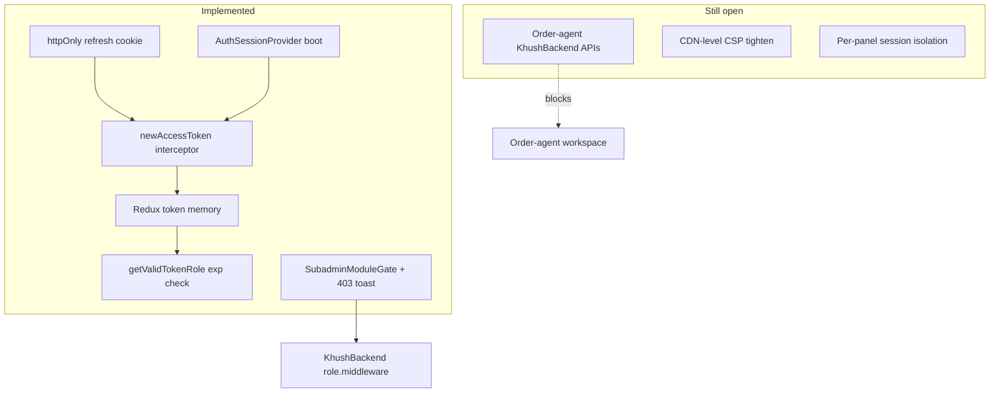

# Khushadminpanel — Security Status (Post-Fix Scan)

**Scan date:** June 22, 2026  
**Scope:** Full `Khushadminpanel` static re-scan after the [Admin Panel Security Fix Plan](https://cursor.com) implementation  
**Baseline:** [ADMIN_PANEL_SECURITY_AUDIT.md](./ADMIN_PANEL_SECURITY_AUDIT.md)  
**Method:** Code grep + file review (no dynamic pentest)

---

## Executive summary

| Category | Fixed | Partial | Open |
|----------|:-----:|:-------:|:----:|
| Token & refresh (P0) | 8 | 1 | 1 |
| Auth surfaces & OTP | 6 | 0 | 1 |
| Role & route guards | 4 | 0 | 0 |
| Module access (UI) | 4 | 1 | 1 |
| Order-agent | 1 | 1 | 2 |
| Logging & console | 3 | 1 | 1 |
| Headers / CSP / env | 3 | 2 | 2 |
| Dependencies | 0 | 0 | 1 |

**Bottom line:** Critical client auth alignment with KhushBackend is **largely complete** — memory-only access tokens, httpOnly refresh cookies, silent `newAccessToken`, JWT `exp` guards, and auth-path logging cleanup are in place. **Real enforcement remains on the API.** Remaining work is mostly **order-agent backend**, **ops hardening** (CSP at CDN, Maps key referrer), **legacy console noise in dev**, and **staging verification** of module delegation.

---

## What was fixed

### 1. Token storage & refresh

| Item | Evidence | Status |
|------|----------|--------|
| Access token not persisted | `redux-persist` transform strips `token` / `refreshToken` in `src/redux/Appstore.js` | ✅ Fixed |
| Memory-only token in Redux | `GlobalSlice` `setToken` / `setRole`; rehydrate sets `token: null` | ✅ Fixed |
| httpOnly refresh cookie | `withCredentials: true` in `src/admin/services/Apiconnector.js` + `src/utils/authSession.js` | ✅ Fixed |
| Silent refresh on 401 | `newAccessToken` interceptor + single-flight `runTokenRefresh()` in Apiconnector | ✅ Fixed |
| Boot-time session restore | `AuthSessionProvider` calls `refreshAccessToken` after persist rehydrate | ✅ Fixed |
| Role sync after refresh | `dispatch(setRole(decodeTokenRole(newToken)))` in `AuthSessionContext.jsx` | ✅ Fixed |
| Device binding | `x-device-id` via `getOrCreateDeviceId()` on requests and refresh | ✅ Fixed |
| Legacy token cleanup | `clearLegacyAuthStorage()` removes old `localStorage` token keys on boot | ✅ Fixed |
| Skip broken ORDER_AGENT refresh | `normalizeRole(refreshRole) !== "ORDER_AGENT"` guard in `AuthSessionContext` | ✅ Fixed |

**Grep verification:** No `localStorage.*token` or `localStorage.*refreshToken` in `src/` (only stale text in `driver/docs/DRIVER_API_SCAN.md`).

---

### 2. Auth flows & OTP hygiene

| Item | Evidence | Status |
|------|----------|--------|
| OTP not logged | No `res.data.otp`, `OTP received`, or auth-path `console.*` under `**/Auth/**` | ✅ Fixed |
| Pre-auth IDs in sessionStorage | Support/order-agent login + OTP use `sessionStorage`; clear helpers in `authRole.js` also remove legacy `localStorage` keys | ✅ Fixed |
| Admin unknown-role OTP | `default` branch → `logout()` + *"This account is not allowed on admin login."* in `admin/Auth/Otp.jsx` | ✅ Fixed |
| Post-login role on all OTP panels | `setToken` + `setRole` in admin, subadmin, designer, driver, influencer, support-agent, order-agent OTP handlers | ✅ Fixed |
| Cross-panel session cleanup | `clearOtherPanelSessions()` on OTP verify and `ProtectedRoute` | ✅ Fixed |
| Server validation on boot (admin/subadmin) | `getUserProfile()` / `getMyModuleAccess()` in `AuthSessionContext`; logout on failure | ✅ Fixed |

---

### 3. Role-based route guards

| Item | Evidence | Status |
|------|----------|--------|
| JWT `exp` in guards | `getValidTokenRole()` in `ProtectedRoute.jsx` | ✅ Fixed |
| `SUPER_SUBADMIN` on subadmin panel | `STAFF_PANEL_ROLES` + `allowedRoles={STAFF_PANEL_ROLES}` in `subadminroutes.jsx` | ✅ Fixed |
| Admin panel ADMIN-only | `adminroutes.jsx` unchanged (ADMIN only) | ✅ Correct |
| Role alias normalization | `SUPER_SUBADMIN` → `SUBADMIN` in `authRole.js` `ROLE_ALIASES` | ✅ Fixed |

---

### 4. Module-based access (frontend)

| Item | Evidence | Status |
|------|----------|--------|
| Module fetch for super_subadmin | `ModuleAccessContext` `shouldFetch` includes `SUBADMIN`, `rawRole === "super_subadmin"`, explicit `SUPER_SUBADMIN` | ✅ Fixed |
| Admin-only order-agents CRUD path | `order-agents` in `ADMIN_ONLY_ROUTE_PATTERNS` (`adminPanelModuleMap.js`) | ✅ Fixed |
| 403 UX for subadmin | Toast *"Module access denied"* in Apiconnector for 403 on `/subadmin/*` | ✅ Fixed |
| UI gating stack | `ModuleAccessContext` → `SubadminModuleGate` → sidebar `canUse()` | ✅ In place |

**Note:** UI gating does **not** replace API auth. Backend `role.middleware.js` module delegation is the real boundary.

---

### 5. Order-agent panel (client-only gate)

| Item | Evidence | Status |
|------|----------|--------|
| Workspace disabled by default | `VITE_ORDER_AGENT_ENABLED=false` in `.env.example` | ✅ Fixed |
| Unavailable page | `OrderAgentUnavailable.jsx` + `OrderAgentWorkspaceGate.jsx` on protected routes | ✅ Fixed |
| Login/OTP routes still reachable | Auth routes outside gate (prep for future backend) | ✅ By design |

---

### 6. Logging & production console

| Item | Evidence | Status |
|------|----------|--------|
| Central logger | `src/utils/logger.js` + `logLevel.js` | ✅ Fixed |
| Production console patch | `configureConsole.js` imported in `main.jsx`; silences log/info/debug per `VITE_LOG_LEVEL` | ✅ Fixed |
| Auth-path console cleanup | Admin OTP, subadmin login, admin sidebar logout, influencer login, notification socket | ✅ Fixed |
| Debug flags blocked in prod | `debugFlags.js` pattern (orders, order-agent) | ✅ Fixed |

---

### 7. API URL, env, CSP

| Item | Evidence | Status |
|------|----------|--------|
| Env-based API URL | `getApiBaseUrl()` / `getSocketUrl()` in `apiConfig.js` | ✅ Fixed |
| Socket host aligned with REST | `NotificationContext` uses `getSocketUrl()` | ✅ Fixed |
| `.env` gitignored | `.gitignore` includes `.env` and `.env.*` (keeps `.env.example`) | ✅ Fixed |
| Production CSP meta | Injected in `vite.config.js` `securityHeadersPlugin` for prod builds | ⚠️ Partial |
| Referrer policy meta | `strict-origin-when-cross-origin` in prod `index.html` transform | ✅ Fixed |

---

### 8. Backend alignment (verified, no panel code change)

| Item | Status |
|------|--------|
| `super_subadmin` on order/report/analytics routes | ✅ Present in KhushBackend (prior pass) |
| No `allowRoles("admin", "subadmin")` without `super_subadmin` | ✅ Grep clean |
| Catalog `allowRoles("admin")` + module delegation | ✅ By design in `role.middleware.js` |

---

## What still needs to be fixed

### P0 — Blocking / high impact

| # | Finding | Status |
|---|---------|--------|
| **R1** | Order-agent backend missing | ⏸️ Deferred (per your request) |
| **R2** | Admin order-agents CRUD 404 | ⏸️ Deferred with order-agent |
| **R3** | CORS + credentials in deployed envs | ✅ **Fixed** — `app.js` now uses `corsAllowedOrigins` from `env.config.js` (+ `CORS_ALLOWED_ORIGINS` env); added `localhost:5174` default |

---

### P1 — Security hardening (recommended)

| # | Finding | Status |
|---|---------|--------|
| **R4** | CSP only in prod Vite build | ⚠️ **Improved** — prod CSP includes API + `VITE_CDN_BASE_URL` in `connect-src`/`img-src`; still add CDN/nginx policy for multi-env |
| **R5** | Shared Redux token across panels | ⏳ Open — mitigated by `clearOtherPanelSessions`; per-panel isolation is a larger follow-up |
| **R6** | No boot-time server validation for non-staff panels | ✅ **Fixed** — designer/driver/influencer/support-agent validated in `AuthSessionContext` |
| **R7** | 429 rate-limit handling | ✅ **Fixed** — shared handler in `Apiconnector` + `apiErrors.js` |
| **R8** | npm audit vulnerabilities | ⏳ Open — run `npm audit fix` manually when ready (may bump deps) |

---

### P2 — Cleanup & ops (lower urgency)

| # | Finding | Status |
|---|---------|--------|
| **R9** | ~90 files raw `console.*` | ⏳ Open — silenced in prod; incremental migration |
| **R10** | Influencer sidebar logout `console.error` | ✅ **Fixed** |
| **R11** | Influencer coupon API/component logs | ✅ **Fixed** |
| **R12** | `dangerouslySetInnerHTML` in `centralstock.jsx` | ✅ **Fixed** — keyframes moved to `index.css` |
| **R13** | Maps embed key referrer restriction | ⏳ Ops — restrict in Google Cloud Console |
| **R14** | Vite dev server `host: true` | ✅ **Fixed** — defaults to `localhost`; set `VITE_DEV_LAN=true` for LAN |
| **R15** | Production API fallback when env unset | ✅ **Fixed** — `warnIfProductionApiUrlMissing()` at boot |
| **R16** | Stale driver docs `localStorage` token | ✅ **Fixed** |
| **R17** | Module delegation staging proof | ⏳ Manual test in staging |

---

## Grep verification matrix (June 22, 2026)

| Check | Command / pattern | Result |
|-------|-------------------|--------|
| Token in localStorage | `localStorage.*token\|refreshToken` in `src/` | ✅ Clean (docs only) |
| OTP leakage | `res.data.otp`, OTP console logs | ✅ Clean |
| Refresh wiring | `withCredentials`, `newAccessToken`, `x-device-id` | ✅ Present |
| Auth-path console | `console.*` under `**/Auth/**` | ✅ Clean |
| Order-agent gate | `VITE_ORDER_AGENT_ENABLED`, `OrderAgentWorkspaceGate` | ✅ Present |
| SUPER_SUBADMIN guard | `STAFF_PANEL_ROLES` in `subadminroutes.jsx` | ✅ Present |
| Backend order-agent | `order-agent` / `order-agents` in KhushBackend `src/` | ❌ Not implemented |

---

## Manual test checklist (staging)

Run after each deploy to `admin.khushpehno.com` or staging:

| Panel | Login → OTP | Refresh restores session | 401 → silent refresh | Logout blocks routes | Module deny |
|-------|:-----------:|:----------------------:|:--------------------:|:--------------------:|:-----------:|
| Admin | ☐ | ☐ | ☐ | ☐ | n/a |
| Subadmin | ☐ | ☐ | ☐ | ☐ | ☐ |
| Super subadmin | ☐ | ☐ | ☐ | ☐ | ☐ |
| Designer | ☐ | ☐ | ☐ | ☐ | n/a |
| Driver | ☐ | ☐ | ☐ | ☐ | n/a |
| Influencer | ☐ | ☐ | ☐ | ☐ | n/a |
| Support-agent | ☐ | ☐ | ☐ | ☐ | n/a |
| Order-agent | ☐ (gated) | ☐ (backend TBD) | ☐ | ☐ | n/a |

---

## Architecture (current)

---

## Related docs

- [TOKEN_REFRESH_ROLE_MODULE_SCAN.md](./TOKEN_REFRESH_ROLE_MODULE_SCAN.md) — token/refresh/role/module flow scan + fixes
- [ADMIN_PANEL_SECURITY_AUDIT.md](./ADMIN_PANEL_SECURITY_AUDIT.md) — original findings & checklist
- [KhushBackend/docs/BACKEND_SECURITY_AUDIT.md](../../KhushBackend/docs/BACKEND_SECURITY_AUDIT.md)
- [KhushBackend/docs/MODULE_ACCESS.md](../../KhushBackend/docs/MODULE_ACCESS.md)

---

## Recommended next steps (priority order)

1. **Deploy & smoke-test** admin/subadmin refresh + module access in staging (R3, R17).
2. **Build order-agent backend** (R1, R2) — then enable `VITE_ORDER_AGENT_ENABLED=true`.
3. **CSP at reverse proxy** for production admin origin (R4).
4. **npm audit fix** and dependency review (R8).
5. **Incremental console → logger migration** on orders/inventory if dev noise is a problem (R9).

*Static scan only. Confirm exploitability and CORS/cookie behavior with browser testing against your deployed API.*
