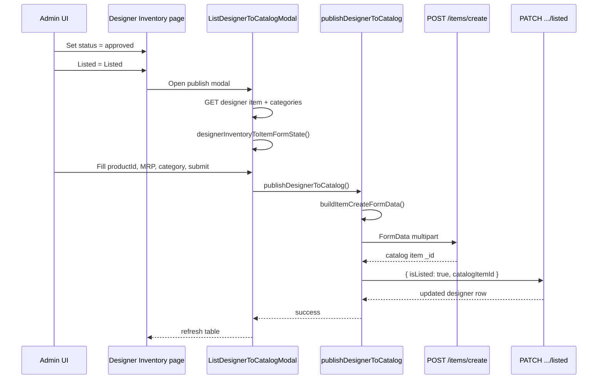

# Designer listing → main catalog (`POST /items/create`)

This document describes how an **approved** designer inventory row is published to the **main catalog** (MongoDB item collection) from the admin panel, and where to look in the browser console.

---

## End-to-end flow



### Step-by-step (what you do in the UI)

1. **Designer Inventory** (`/admin/designer/inventory`)
   - Filter **submitted** → change status to **approved**  
     - API: `PATCH /api/admin/panels/designer/inventory/:id/status`  
     - Body: `{ "status": "approved" }`
2. Set **Listed** → **Listed**
   - Opens **Publish to main inventory** modal (only if status is `approved`).
3. In the modal:
   - Confirm **primary category** / **subcategory** (prefilled from designer `categoryId` / `subcategoryId` when present).
   - Set **Product ID** (required unique catalog id), **MRP** > 0, and any catalog-only fields.
   - Click **Save** / submit.
4. Backend:
   - **Creates** the main catalog item → `POST /api/items/create` (multipart `FormData`).
   - **Links** the designer row → `PATCH /api/admin/panels/designer/inventory/:id/listed`  
     - Body: `{ "isListed": true, "catalogItemId": "<new item _id>" }`

To **unlist** without deleting the catalog item:

- Listed = **Not listed** → `PATCH .../listed` with `{ "isListed": false }` only (no `items/create`).

---

## Code map (frontend)

| Piece | File | Role |
|--------|------|------|
| Orchestrator | `src/admin/utils/publishDesignerToCatalog.js` | Runs create + listed PATCH with logs |
| FormData builder | `src/admin/utils/buildItemCreateFormData.js` | Same payload shape as `ItemForm.jsx` create |
| Designer → form | `designerInventoryToItemFormState()` in same file | Maps designer API document to catalog form state |
| FormData debug | `src/admin/utils/logFormDataSummary.js` | Logs keys / file names (not full binary) |
| HTTP create | `src/admin/apis/itemapi.js` → `createItem()` | `POST /items/create` |
| HTTP listed | `src/admin/apis/Designerapi.js` → `patchDesignerInventoryListed()` | `PATCH .../inventory/:id/listed` |
| UI entry | `src/admin/components/designer/ListDesignerToCatalogModal.jsx` | Modal form + calls `publishDesignerToCatalog` |
| List + approve | `src/admin/components/designer/DesignerInventory.jsx` | Opens modal when Listed = Yes |

---

## `POST /items/create` payload (summary)

Built by `buildItemCreateFormData(form, categoryId, subcategoryId)`:

| Field | Source |
|--------|--------|
| `name`, descriptions, meta*, `price`, `discountedPrice` | Modal form (from designer + admin edits) |
| `productId` | Admin must enter in modal (not on designer row) |
| `categoryId`, `subcategoryId` | Modal dropdowns |
| `skuCodeInputs` | JSON — style, gender, product type code, fit |
| `variants` | JSON — colors, sizes, SKUs, image URLs |
| `care`, `sizeCharts`, policies, `filters` | From designer + form |
| File fields | `variants[ColorName]`, `careInstructionIcons[n]`, measure images, etc. |

Stock per size uses designer `producedQty` → `plannedQty` → `stock` when mapping variants.

---

## Console log tags (DevTools)

Filter the console by these prefixes while testing:

| Tag | When |
|-----|------|
| `[DesignerInventory]` | List fetch, approve, open modal, unlist |
| `[ListDesignerToCatalogModal]` | Load item, submit |
| `[designerInventoryToItemFormState]` | Designer doc → catalog form |
| `[buildItemCreateFormData]` | FormData assembly start/end |
| `[itemapi] POST /items/create` | Network create call |
| `[POST /items/create]` | FormData field summary (from `logFormDataSummary`) |
| `[publishDesignerToCatalog]` | Full publish pipeline steps 1–4 |
| `[DesignerAPI] PATCH inventory/listed` | After catalog create |

### Example successful sequence

```
[ListDesignerToCatalogModal] submit — publish flow { designerInventoryId, categoryId, subcategoryId }
[publishDesignerToCatalog] START
[publishDesignerToCatalog] step 1 — buildItemCreateFormData
[buildItemCreateFormData] start { name, productId, variantCount }
[buildItemCreateFormData] done
[POST /items/create] N field(s) [...]
[publishDesignerToCatalog] step 2 — POST /items/create
[itemapi] POST /items/create — start
[itemapi] POST /items/create — success { itemId: "..." }
[publishDesignerToCatalog] step 3 — catalog item saved { catalogItemId }
[publishDesignerToCatalog] step 4 — PATCH designer inventory listed
[DesignerAPI] PATCH inventory/listed response
[publishDesignerToCatalog] DONE
```

---

## Programmatic use (reuse)

```javascript
import { publishDesignerToCatalog } from "../utils/publishDesignerToCatalog";
import { designerInventoryToItemFormState } from "../utils/buildItemCreateFormData";

const form = designerInventoryToItemFormState(designerDoc);
form.productId = "UNIQUE-PRODUCT-ID";
form.price = "1499";

const result = await publishDesignerToCatalog({
  designerInventoryId: designerDoc._id,
  designerRow: designerDoc,
  form,
  categoryId: designerDoc.categoryId,
  subcategoryId: designerDoc.subcategoryId,
});

console.log(result.catalogItemId, result.updatedDesigner);
```

---

## Common failures

| Symptom | Likely cause |
|---------|----------------|
| “Approve before listing” | Designer `status` ≠ `approved` |
| “Product ID is required” | Empty `productId` in modal |
| “MRP must be greater than 0” | `price` / designer `mrp` is 0 |
| “At least one variant…” | No color/size rows after mapping |
| Create OK but no `_id` | Backend response shape changed — check `unwrapCatalogItemFromCreateResponse` |
| 413 / upload errors | Large variant files — same limits as main ItemForm |

---

## Related APIs (reference)

| Method | Path | Body |
|--------|------|------|
| PATCH | `/api/admin/panels/designer/inventory/:id/status` | `{ "status": "approved" \| "rejected" \| ... }` |
| POST | `/api/items/create` | `multipart/form-data` |
| PATCH | `/api/admin/panels/designer/inventory/:id/listed` | `{ "isListed": true \| false, "catalogItemId?": "..." }` |
| GET | `/api/admin/panels/designer/inventory/:id` | Load full designer item for modal |

Base URL is configured in `src/admin/services/Apiconnector.js` (`baseURL` + path).
